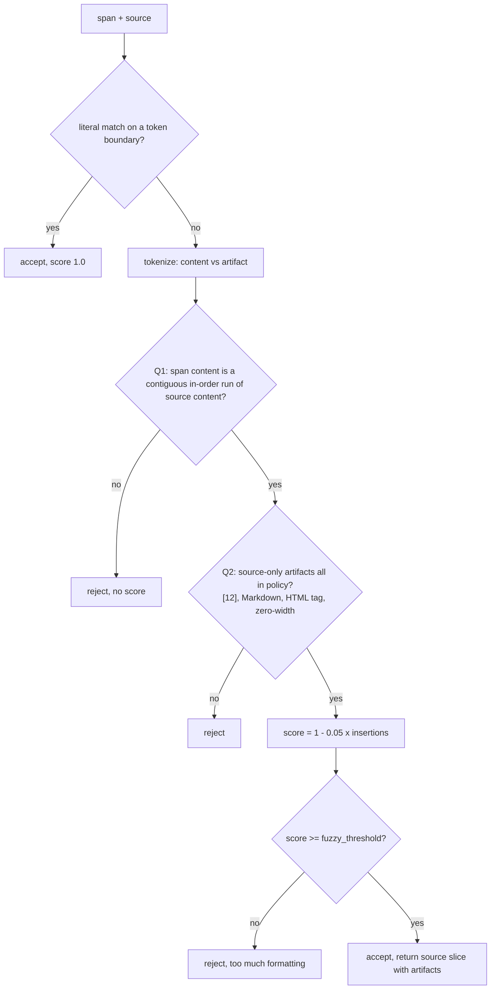

# Proposal: check span content before fuzzy scoring

Issue: [#34](https://github.com/KRLabsOrg/verbatim-rag/issues/34)
Status: proposal, no code yet

## Summary

`span_match_mode="fuzzy"` decides with one similarity score. That score cannot tell a changed number from a removed formatting mark. This proposal checks the words and numbers first, then the formatting, and only then computes a score.

## Motivation

Measured with the current code (`partial_ratio_alignment` on the normalized text, threshold 0.8):

| LLM span | Source | Score | Result | Should be |
|---|---|---|---|---|
| `The rate was 6%.` | `The rate was 5%.` | 0.94 | accepted | rejected |
| `to $4.2 billion` | `to $4.3 billion` | 0.98 | accepted | rejected |
| `Aspirin reduced mortality` | `Aspirin increased mortality` | 0.90 | accepted | rejected |
| `version 2.4.1` | `version 2.4.10` | 1.00 | accepted | rejected |
| `The rate was 5%.` | `The **rate** was 5% [12].` | 0.78 | rejected | accepted |

The ordering is backwards, so no threshold value fixes it.

## Goals

- A changed, missing or extra word or number is always rejected, at any threshold.
- Source-side formatting from a short list is tolerated and returned as part of the span.
- `span_match_mode` and `fuzzy_threshold` keep working; only the meaning of the score changes.
- All four extraction paths keep sharing one validator.

## Non-goals

- OCR letter substitutions (`rale` for `rate`). Any rule loose enough for that also accepts `reduced` for `increased`.
- Treating `(12)` as a citation. `(2023)` is usually a year.
- A new public configuration surface. The allow-list is code until real corpora show it must vary.

## Proposal

### Tokens

Two kinds. **Content** is a run of letters or digits, keeping the punctuation that lives inside a token: `4.2`, `2.4.10`, `5%`, `-3`, `don't`, and a word hyphenated across a line break. **Artifact** is every other non-space character. Citation markers like `[12]`, Markdown runs like `**`, HTML tags and zero-width characters are single artifact tokens with a known kind.

Comparison text is NFKC, casefolded, with curly quotes mapped to straight ones.

### Q1, content

The span's content tokens must appear as one contiguous run inside the source's content tokens. No score is computed if they do not. This is the hard rule.

### Q2, artifacts

Walk the span and the source together across the matched run. Punctuation present on both sides is matched. Punctuation only in the span is skipped. Artifacts only in the source must be one of the known kinds, otherwise the match fails. Markdown directly touching the first or last matched token is included so `**word**` stays balanced.

### Score

`1.0` for an exact token alignment, minus `0.05` for each source-only artifact. The default threshold of `0.8` therefore allows four. The threshold still rejects, but only for too much formatting. Returned text is the source slice from the first to the last consumed token: `The **rate** was 5% [12].` for the span `The rate was 5%.`

### Fast path

Literal containment stays first, but it must not split a token. `version 2.4.1` is a substring of `version 2.4.10` and is currently accepted for that reason alone.

## Examples after the change

| LLM span | Source | Result |
|---|---|---|
| `The rate was 6%.` | `The rate was 5%.` | rejected at Q1 |
| `The rate was 5%.` | `The **rate** was 5% [12].` | `The **rate** was 5% [12].` (0.85) |
| `The rate was 5%.` | `The <b>rate</b> was 5%.` | `The <b>rate</b> was 5%.` (0.90) |
| `The "rate" was 5%` | `The “rate” was 5%` | source text (1.0) |
| `The document was 5%.` | `The docu-\nment was 5%.` | source text (1.0) |
| `5% here.` | `**5%** here. **5%** here.` | first occurrence, `**5%** here.` |

## Compatibility

Public API unchanged. Callers that read the score get a different scale. `rapidfuzz` becomes unused in `verbatim-core`; dropping it is a separate small change. Exact mode is untouched.

## Alternatives considered

- Raise the threshold. Does not help, the ordering is inverted.
- Weight digits more in the similarity. Still a soft score; `reduced` vs `increased` would remain a judgment call.
- Allow any punctuation as an artifact. Simpler, but a first draft doing exactly that failed the existing spacing tests. Matching punctuation on both sides is what makes those pass.
